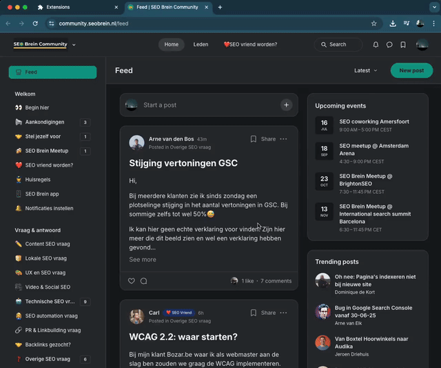

# SEO Brein Util

> **Note:** This repository contains AI-generated code and text.

A Chrome extension (Manifest V3) that automatically translates Dutch content to English on `community.seobrein.nl/*` pages.

Google Translate is able to translate most of the content, but some parts are not translated correctly. This extension aims to fix those issues by providing a custom translation for specific elements.

## Features

- **Configurable CSS Selectors**: Customize which elements to translate through the options page
- **Chrome Auto-Translate Compatible**: Works alongside Chrome's built-in translation feature
- **Persistent Cache**: Translations are cached to improve performance
- **Dynamic Content Support**: Automatically detects and translates new content added to the page

## Configuration

1. Right-click the extension icon and select "Options"
2. Configure the CSS selectors that should be translated (one per line)
3. The default selector is hardcoded in code, but you can add more as needed
4. Click "Save Settings" to apply changes

## Local Installation

1. Download the code from GitHub:
   - Click the green "Code" button on the repository page
   - Select "Download ZIP" or clone using: `git clone https://github.com/yalpertem/seo-brein-util.git`
2. Extract the files to a folder on your computer
3. Open Chrome and navigate to `chrome://extensions/`
4. Enable "Developer mode" using the toggle in the top right
5. Click "Load unpacked" and select the folder containing the extension files
6. The extension will now appear in your Chrome extensions list

## Usage

- Enable Chrome's auto-translate feature for the best experience
- This extension will complement Chrome's translation by targeting specific elements
- The extension works automatically on `community.seobrein.nl` pages